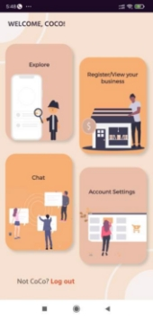
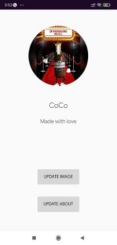
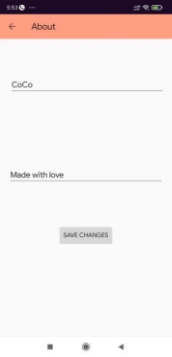
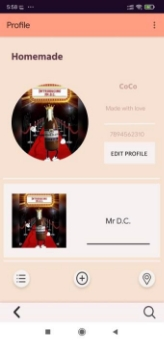

### Application for commercial and homemade businessess and also for providing various services

 Sanjana Nalawade , Himanshu Raut , Sahil Naik   

**TABLE OF CONTENTS** 

<ol>
  <li> Introduction  </li>
 <li> Problem statement </li>
 <li> Motivation </li>
 <li> Objective </li>
 <li> System Architecture </li>
 <li> State Diagram </li>
 <li> Implementation</li>
 <li> Hardware and Software requirements </li>
 <li> Principle and working of project </li>
 <li> Snapshots of application </li>
 <li> Conclusion </li>
 <li> Future Scope</li>
 <li> References </li>
  </ol>
  
### Introduction

In today’s world, with Lockdown and inaccessible services and products, online shopping has gained immense popularity, which has resulted an increase the sale and  demands  for  homemade  products  and  services,  our  app  allows  local businesses  to  list  their  products  and  services  along  with  their  location  and availability.  The  consumer  also  could  search  for  their  required  services,  and classify them via location. Our application also had a chat interface, whereby consumers and businesses could get in touch in case of grievances or inquiry. Customers could further review the products and businesses. 

### Problem statement 

- No  proper  application  platform  for  the  local  business  to  sell  their products and services, which led to selling of these on social media.
- Demands for homemade products and services are increasing day by day.
- On  social  media,  it  is  difficult  to  filter  out  these  businesses  as  per locations that are near to a consumer.
- 
### Motivation

Inspired  with  the  current  situation  where  local  businesses  are booming with no proper platform to endorse them, we thought of creating one for through our application. 

### Objective
- Inspired with the current situation where local businesses are booming with no proper platform to endorse them, we thought of creating one for through our application. 
- Our  main  objective  is  to  create  an  application  that  promotes local businesses and services 
- In  our  application  the  seller  can  register  their  business  and upload photos of their products and importantly need to specify the location of their business 
- The consumer can search for the needful service or product and contact the seller, for ease these businesses will be sorted as per the user’s location. 

### System Architecture

###  State Diagram

  ### Hardware and Software requirements

a. Software  Requirements:  Android  studio  IDE  (with  SDK bundle)  and  Java  SDK  for  android  application development. 

b. Hardware  Requirements:   4  GB  or  more  ram  (highly recommended),  i5  or  i7  processor (recommended),  one android device (used for testing, because physical device work fast and more powerful than pc emulator.) 

### Principle and working of project

a. User can signup and register his business and can add his products in the form of post, also can search for various other businesses. Can add details about one’s business like contact details, address etc** 
|
### Snapshots of application.

### SignUp:   

 

### Login:

### Forgot Password:

###  Home:   

 ### Account Settings:
 
 
 ### About:
 

### Register 1:    

### Register 2:

### Profile:

### Add new post: 

### View All post  

### Conclusion  

We aimed to solve the current issue and created an application Buzinest, which is the one place stop for all kinds of businesses big and small, and also for services, freelancing and many more. Promote your businesses and grow using Buzinest. Shop at the ease and safety of home.  

### Future Scope

We intend to use messaging service integrated in the application for better experience of the seller and buyer. Also, improving the UI and app flow with better algorithm for location search.  

### References

[https://developer.android.com/docs ](https://developer.android.com/docs)[https://firebase.google.com/docs ](https://firebase.google.com/docs)[https://developers.google.com/maps/documentation ](https://developers.google.com/maps/documentation)
